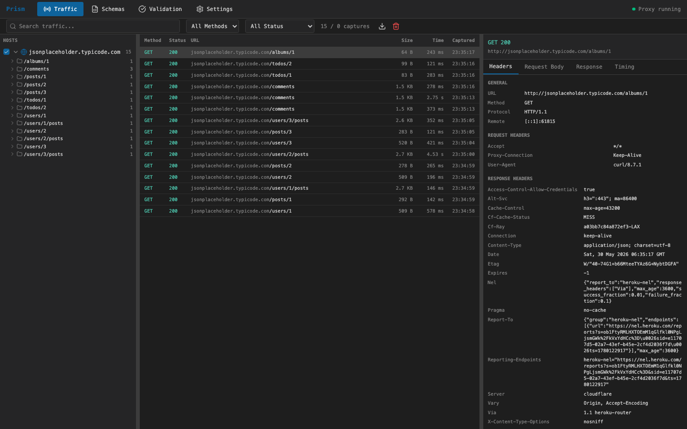

# Prism

**Point Prism at any API and it figures out the schema for you.**

Prism is a MITM proxy that captures HTTP/HTTPS traffic and uses AI to infer path patterns and full OpenAPI specifications from observed requests and responses. It watches traffic like `/users/123`, `/users/456`, and `/users/789/posts` and recognizes that these are `GET /users/{id}` and `GET /users/{id}/posts` — detecting path parameters, response schemas, enum values, and type constraints automatically.

Once inferred, Prism generates typed client code in multiple languages and validates live traffic against the spec in real time.



## How It Works

1. **Capture** — Prism sits between your client and any API, intercepting HTTP/HTTPS traffic transparently
2. **Learn** — As traffic flows, Prism tracks URL patterns, detects path parameters (UUIDs, numeric IDs, slugs), and builds a model of each endpoint's request/response shape
3. **Infer** — AI analyzes the accumulated patterns and response bodies to produce a complete OpenAPI 3.0 specification with proper schemas, types, and descriptions
4. **Generate** — From the OpenAPI spec, Prism deterministically generates typed code: TypeScript interfaces, Go structs, Protobuf definitions, JSON Schema, Avro, and GraphQL SDL
5. **Validate** — Live traffic is validated against the inferred spec in real time, with AI-powered fixes when the schema drifts

## Features

- **AI Path Pattern Inference** — Automatically discovers API structure from raw traffic: path parameters, response schemas, enum values, type constraints (int32 vs int64, UUID vs string), and endpoint groupings
- **Multi-Format Code Generation** — From a single inferred spec, generates TypeScript, Go, Protobuf, JSON Schema, Avro, GraphQL, and SQL
- **Live Validation** — Real-time request/response validation against inferred schemas via SSE, with AI-powered schema fixes
- **HTTP/HTTPS Interception** — Full MITM proxy with dynamic CA certificate generation
- **WebSocket Capture** — Bidirectional message capture and inspection
- **MCP Integration** — Expose captured traffic and inferred schemas to Claude via Model Context Protocol
- **Modern Web UI** — Traffic inspection, schema browsing, and live validation dashboard

## Architecture

```
┌─────────────────────────────────────────────────────────────────┐
│                     CLIENT (Browser/App)                        │
└─────────────────────────────┬───────────────────────────────────┘
                              │
                              ▼
┌─────────────────────────────────────────────────────────────────┐
│                    PROXY SERVER (Go) :8080                      │
├─────────────────────────────────────────────────────────────────┤
│  ┌──────────────┐  ┌──────────────┐  ┌──────────────────────┐  │
│  │ TLS MITM     │  │ HTTP Handler │  │ WebSocket Relay      │  │
│  │ (dynamic CA) │  │ (capture)    │  │ (bidirectional)      │  │
│  └──────────────┘  └──────────────┘  └──────────────────────┘  │
│                           │                                     │
│  ┌──────────────────────────────────────────────────────────┐  │
│  │                    SQLite Storage                         │  │
│  └──────────────────────────────────────────────────────────┘  │
│                           │                                     │
│  ┌──────────────────────────────────────────────────────────┐  │
│  │              AI INFERENCE ENGINE (Claude/OpenAI)          │  │
│  │  OpenAPI • TypeScript • Go • Protobuf • JSON Schema       │  │
│  └──────────────────────────────────────────────────────────┘  │
└─────────────────────────────────────────────────────────────────┘
         │                              │
         ▼                              ▼
┌─────────────────────┐      ┌─────────────────────────────────┐
│  REST API :9090     │      │  MCP Server (stdio)             │
│  Web UI :3000       │      │  For Claude Desktop/CLI         │
└─────────────────────┘      └─────────────────────────────────┘
```

## Quick Start

### Prerequisites

- Go 1.22+
- Node.js 20+
- Anthropic API key (for AI features)

### Installation

```bash
# Clone the repository
git clone https://github.com/knoguchi/prism.git
cd prism

# Install dependencies
make deps

# Build everything
make build
```

### Configuration

1. Set your API key:
```bash
export ANTHROPIC_API_KEY=sk-ant-...
```

2. Edit `configs/proxy.yaml` as needed (defaults work for most cases)

### Running

**Terminal 1 - Proxy Server:**
```bash
make run-proxy
# Proxy: :8080, API: :9090
```

**Terminal 2 - Web UI:**
```bash
make run-web
# Web UI: http://localhost:3000
```

### Configure Your System Proxy

Set your system or browser to use `localhost:8080` as the HTTP/HTTPS proxy.

### Install CA Certificate

1. Visit `http://localhost:9090/api/config/ca/download` to download the CA certificate
2. Install it in your system/browser trust store:
   - **macOS**: Open Keychain Access, drag cert to "System" keychain, set to "Always Trust"
   - **Windows**: Double-click cert, install to "Trusted Root Certification Authorities"
   - **Linux**: Copy to `/usr/local/share/ca-certificates/` and run `update-ca-certificates`

## Usage

### Web UI

Access the web interface at `http://localhost:3000`:

- **Traffic** - View all captured HTTP traffic, filter by host/method/status
- **Schemas** - Run AI analysis to generate OpenAPI specs, view generated code
- **Validation** - Live validation of traffic against generated schemas with AI-powered fixes

### Workflow

1. **Capture Traffic** - Browse/use your application while proxy captures requests
2. **Enable Hosts** - Select which hosts to analyze in the Traffic tab
3. **Analyze** - Click "Analyze" in the Schemas tab to generate OpenAPI specs
4. **Validate** - Monitor live traffic validation in the Validation tab
5. **Fix Errors** - Use "AI Fix" button to automatically fix schema validation errors

### MCP Integration (Claude Desktop)

Add to your Claude Desktop config (`~/Library/Application Support/Claude/claude_desktop_config.json`):

```json
{
  "mcpServers": {
    "prism": {
      "command": "/path/to/prism/bin/prism-mcp",
      "args": ["--db", "/path/to/prism/data/proxy.db"]
    }
  }
}
```

Available MCP tools:
- `list_captures` - List captured traffic with filters
- `list_endpoints` - List observed method/path pairs with traffic counts
- `get_request` - Get full request details (headers, body)
- `get_response` - Get full response details
- `get_examples` - Get example request/response pairs for a path pattern
- `get_slice` - Get endpoints plus example request/response pairs for a path prefix
- `get_websocket_messages` - Get WebSocket messages for a connection
- `get_schema` - Get inferred schema in any format (openapi, typescript, go, protobuf, etc.)

## Configuration

### proxy.yaml

```yaml
proxy:
  listen: ":8080"          # Proxy listen address
  timeout: 30              # Request timeout (seconds)
  skip_hosts:              # Hosts to pass through without MITM
    - "*.sentry.io"

api:
  listen: ":9090"          # REST API listen address
  cors_origins:
    - "http://localhost:3000"

tls:
  ca_cert: "./configs/ca/ca.crt"
  ca_key: "./configs/ca/ca.key"

storage:
  path: "./data/proxy.db"
  max_captures: 100000     # Max captures to retain

inference:
  enabled: true
  min_samples: 3           # Min samples before inferring

llm:
  provider: "anthropic"    # or "openai"
  model: "claude-sonnet-4-20250514"
  max_tokens: 32768
```

### Environment Variables

| Variable | Description |
|----------|-------------|
| `ANTHROPIC_API_KEY` | Anthropic API key for Claude |
| `OPENAI_API_KEY` | OpenAI API key (alternative) |

## Project Structure

```
prism/
├── cmd/
│   ├── proxy/main.go       # Proxy + API server
│   └── mcp/main.go         # MCP server
├── internal/
│   ├── proxy/              # MITM proxy logic
│   ├── ca/                 # CA certificate management
│   ├── storage/            # SQLite storage layer
│   ├── llm/                # LLM provider abstraction
│   ├── inference/          # Path pattern detection
│   ├── codegen/            # Code generation (TS, Go, Proto)
│   ├── validation/         # OpenAPI validation
│   ├── mcp/                # MCP server
│   └── api/                # REST API handlers
├── pkg/models/             # Shared models
├── web/                    # React frontend
├── configs/
│   ├── proxy.yaml          # Configuration
│   └── ca/                 # CA certificates
└── data/proxy.db           # SQLite database
```

## API Reference

### Captures

- `GET /api/captures` - List captures (with filters: host, method, status, path, content_type, page, limit)
- `GET /api/captures/:id` - Get capture details (request + response)
- `DELETE /api/captures/:id` - Delete capture
- `DELETE /api/captures` - Clear all captures (optional `?host=` filter)

### Search

- `GET /api/search?q=query` - Full-text search across traffic (URLs, headers, bodies)

### WebSocket

- `GET /api/websockets` - List WebSocket connections
- `GET /api/websockets/:id/messages` - Get messages for a WebSocket connection

### Schemas

- `GET /api/schemas` - List all schemas
- `GET /api/schemas/:host` - Get host schema endpoints
- `GET /api/schemas/:host/format/:format` - Get schema in format (openapi, typescript, go, protobuf)
- `GET /api/schemas/:host/versions` - List schema versions
- `POST /api/schemas/:host/fix` - Request AI schema fix
- `POST /api/schemas/:host/preview-fix` - Preview fix against sample requests
- `POST /api/schemas/:host/versions/:version/activate` - Activate schema version

### Inference

- `POST /api/inference/:host` - Start AI analysis
- `GET /api/inference/:host/status` - Get analysis status
- `GET /api/inference/:host/diagram` - Get API diagram

### Validation

- `GET /api/validation/:host` - Validate host traffic against schema
- `GET /api/validation/:host/summary` - Get validation summary
- `GET /api/validation/request/:id` - Validate single request
- `GET /api/events/validation/:host` - SSE stream for live validation

### Hosts

- `GET /api/hosts` - List all captured hosts with counts
- `GET /api/hosts/enabled` - Get enabled hosts
- `PUT /api/hosts/enabled` - Set enabled hosts (bulk)
- `POST /api/hosts/enabled/:host` - Add single enabled host
- `DELETE /api/hosts/enabled/:host` - Remove single enabled host

### Statistics

- `GET /api/stats` - Get traffic statistics
- `GET /api/stats/timeline` - Get traffic timeline for charts

### Configuration

- `GET /api/config` - Get current configuration
- `GET /api/config/ca` - Get CA certificate info
- `GET /api/config/ca/download` - Download CA certificate (PEM)

### Real-time Events

- `GET /api/events/traffic` - SSE stream for new traffic
- `GET /api/events/validation/:host` - SSE stream for live validation

## Development

```bash
# Run in development mode
make run-proxy  # Terminal 1
make run-web    # Terminal 2

# Run tests
make test

# Format code
make fmt

# Lint
make lint
```

## Tech Stack

### Backend
- Go 1.22+
- `elazarl/goproxy` - MITM proxy
- `modernc.org/sqlite` - Pure Go SQLite
- `go-chi/chi` - HTTP router
- `getkin/kin-openapi` - OpenAPI validation
- `mark3labs/mcp-go` - MCP server

### Frontend
- React 19 + TypeScript
- Vite
- TailwindCSS
- TanStack Query
- Lucide Icons

## License

MIT

## Acknowledgments

- [Charles Proxy](https://www.charlesproxy.com/) - Inspiration for the UI/UX
- [mitmproxy](https://mitmproxy.org/) - Inspiration for the proxy architecture
- [Anthropic Claude](https://www.anthropic.com/) - AI-powered schema inference
